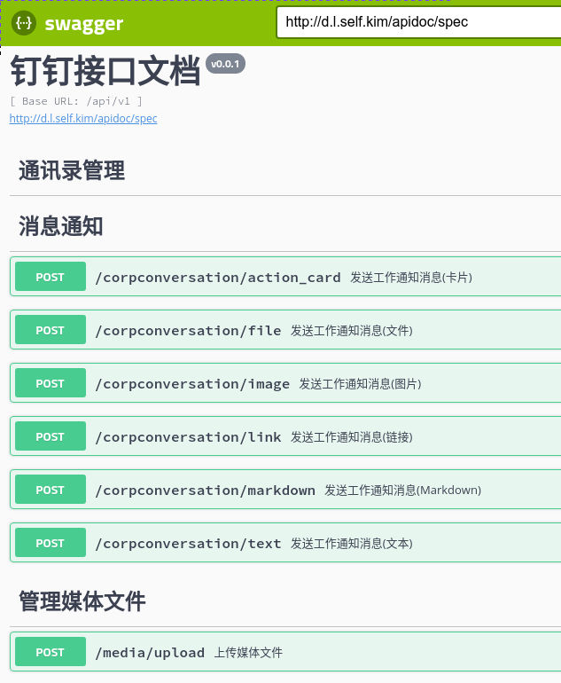

# 钉钉自建H5接口测试

## 修改配置
`dingding_api/config.py`

```python
# 一般不用修改
BASE_URL = 'https://oapi.dingtalk.com/'

# H5应用的各种token
APP_ID = 'eeHaiyeang3n'
APP_SECRET = 'uamei5Meuzae4kaiReejaiThir8ahbo6theed1oph2ohrah5ioqueiluYo0tieCi'
AGENT_ID = '35643513235'

# 企业全局唯一
CORP_ID = 'eehay1eirahteifoong9OhsohF5mae8l'

# 只在 扫码登录第三方网站 才需要
SCAN_APPID = 'eeP7ohb3ooZa'
SCAN_APP_SECRET = 'iaJ1shaay1Vou9hiek0aeph0woh8Iequup5mo5qua5oowuVefiji6su7lae7Aigh'
```

`sample/config.py` 修改`SERVER_NAME`, `SWAGGER.domain`和`SERVER_NAME`保持一致
```python
Config = {
    "SWAGGER": {
        "doc_root": '../doc',
        "base_url": "/api/v1",
        "doc_enable": True,
        "enable_cors": True,
        "swagger_ui": "http://d2.t.self.kim",
        "domain": "http://d.l.self.kim",
        "info": {
            "version": "v0.0.1",
            "title": "钉钉接口文档",
            "description": "测试各种API"
        }
    },
    "SERVER_NAME": "d.l.self.kim",
    "JSON_AS_ASCII": False,
}
```

## 运行
```bash
virtualenv -p python3 venv
. venv/bin/activate
pip install -r requirements.txt
python mani.py
```

## 查看DOC
访问地址 <http://d2.t.self.kim/?url=http://d.l.self.kim/apidoc/spec>

> 其中query参数url 根据自己的地址来, <http://d2.t.self.kim/>保持不变

或者直接访问 <http://d.l.self.kim/apidoc>

## 第三方扫码地址
<http://d.l.self.kim/scan>

## JSAPI测试地址
<http://d.l.self.kim/x> 将应用首页地址设置为它即可

# 实现
1. 通讯录(部门/人员)管理
2. 上传素材(图片/文件)
3. 发送工作消息(文章/图片/文件/markdown/卡片...)
4. 扫码登录第三方网站
5. 企业内部应用免登
6. JSAPI SAMPLE(看图片/扫码/获取位置...)

# 参考
1. <https://github.com/sulin2018/python-dingding>
2. <https://github.com/Huooo/demo-collections>
3. <https://github.com/Huooo/demo-collections/blob/master/20170701-dd-jsapi-m-demo.html>

# 实例

